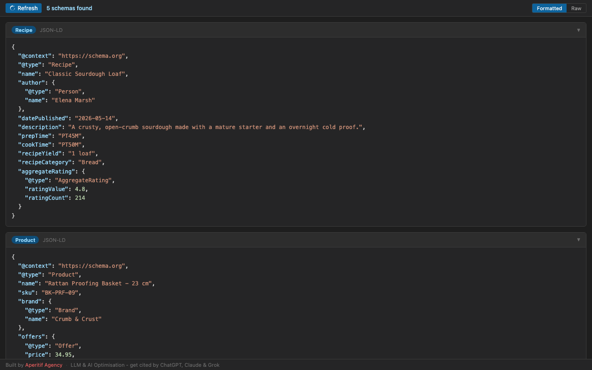

# Schema Checker

A free schema checker for Chrome DevTools. It adds a **Schema** panel that extracts and pretty-prints every [Schema.org](https://schema.org) JSON-LD and Microdata entity on the page you're inspecting - so you can check schema markup as you browse, without pasting URLs into a separate structured data testing tool.



## Features

- **JSON-LD extraction** - parses every `<script type="application/ld+json">` block, including top-level arrays and nested `@graph` documents. Entities inside a `@graph` are unpacked into individual cards and inherit the parent `@context`, per the JSON-LD spec.
- **Microdata extraction** - walks `itemscope`/`itemprop` markup, including nested items, and resolves values from `meta`, `link`, `a`, `img`, and `time` elements.
- **Formatted & Raw views** - syntax-highlighted JSON or plain raw output, one collapsible card per entity, labelled with its `@type` and source.
- **Parse-error surfacing** - malformed JSON-LD blocks are shown with the parser error and the raw markup, so broken structured data is easy to spot.
- **Auto-rescan on navigation** - the panel rescans automatically after page loads and history-API (SPA) navigations.
- **Zero permissions** - no host permissions, no storage, no background scripts. Everything runs inside the DevTools panel against the inspected page.

## Installation

### From source

1. Clone this repository.
2. Open `chrome://extensions` in Chrome.
3. Enable **Developer mode** (top right).
4. Click **Load unpacked** and select the repository folder.

### Usage

1. Open DevTools (<kbd>F12</kbd> or <kbd>Cmd</kbd>+<kbd>Opt</kbd>+<kbd>I</kbd>) on any page.
2. Select the **Schema** panel.
3. Structured data is scanned automatically; click **Refresh** to rescan at any time.

## Privacy

This extension collects no data, makes no network requests, and requires no permissions. All extraction happens locally in your browser against the page you are inspecting.

## Project structure

```
manifest.json    Extension manifest (Manifest V3)
devtools.html    DevTools page that registers the panel
devtools.js      Panel registration
panel.html       Panel UI
panel.js         Extraction + rendering logic
icons/           Extension icons
store-assets/    Web Store imagery + generator script (not shipped in the extension)
```

## Why structured data matters

Search is increasingly answered by entities, not pages. [Google AI Overviews](https://developers.google.com/search/docs/appearance/ai-features) and rich results, and answer engines like ChatGPT, Claude, Perplexity and Grok, all lean on [Schema.org](https://schema.org) structured data to understand what a page is about, how its entities relate, and whether your brand is the one worth citing in an answer.

The usual way to check that markup is high-friction: view source, hunt for `<script type="application/ld+json">` blocks, copy each one into a validator, repeat on every template. This panel removes that loop:

- **Every entity is its own card** - `@graph` documents are unpacked, so an `Organization`, its `WebSite`, the `WebPage` and the `BreadcrumbList` inside one script tag appear as four labelled, collapsible entities instead of one wall of JSON.
- **Relationships stay visible** - nested entities (a `Product`'s `Offer`, an `Article`'s author `Person`) and `@id` references between entities are right there in the formatted view, so you can trace how your entity graph fits together.
- **It follows you around the site** - the panel rescans on every navigation, so comparing the schema on a product page against its category page is just clicking between them.
- **Broken markup is loud** - malformed JSON-LD renders as a parse-error card with the raw block, instead of silently failing in an AI crawler.

Common types you'll see while auditing, each linked to its Schema.org definition: [Organization](https://schema.org/Organization) and [LocalBusiness](https://schema.org/LocalBusiness) (brand identity, `sameAs` social profiles), [Product](https://schema.org/Product) with its [Offer](https://schema.org/Offer) (price, availability), [Article](https://schema.org/Article) and [BlogPosting](https://schema.org/BlogPosting), [BreadcrumbList](https://schema.org/BreadcrumbList) and [ItemList](https://schema.org/ItemList) (site structure and rankings), [FAQPage](https://schema.org/FAQPage), [Recipe](https://schema.org/Recipe), [Event](https://schema.org/Event), [Person](https://schema.org/Person), and the [WebSite](https://schema.org/WebSite) / [WebPage](https://schema.org/WebPage) pair that ties a page into the wider entity graph.

## How it compares to other schema testing tools

[Google's Rich Results Test](https://search.google.com/test/rich-results) and the official [Schema Markup Validator](https://validator.schema.org/) are the right tools for vocabulary-level validation - confirming a Product or Recipe carries every property rich results require. Schema Checker complements them rather than replacing them: it lives inside DevTools, checks every page as you click through a site, and shows extracted entities instantly - including JSON-LD injected by JavaScript after load, which URL-based schema validators can miss on client-rendered sites. Use this panel to find, read, and debug structured data fast; run the page through a validator when you need a compliance verdict.

## Contributing

Found a bug, or a page whose markup the panel mishandles? [Open an issue or pull request on GitHub](https://github.com/aperitifagency/schema-checker) - example URLs and screenshots make extraction bugs much easier to reproduce. For anything else - feature ideas, feedback, or help with your own structured data - [get in touch with Aperitif Agency](https://aperitifagency.com.au/contact/).

## About

Written by Spencer Potts. Built and maintained by [Aperitif Agency](https://aperitifagency.com.au/), a Melbourne digital marketing agency specialising in [LLM & AI Optimisation](https://aperitifagency.com.au/seo/llm-ai-optimisation/) - structuring content and schema so Google AI Overviews and AI assistants like ChatGPT, Claude and Perplexity cite and recommend your brand. Clean structured data is the foundation of that work, and this is the tool we use to check it.
